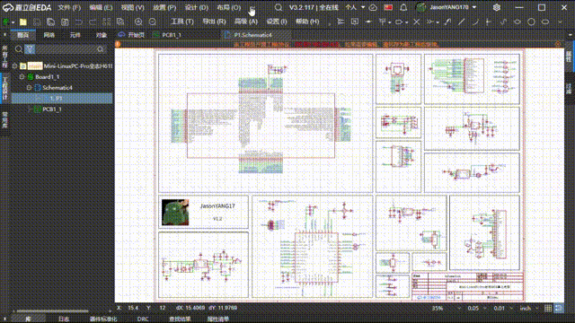
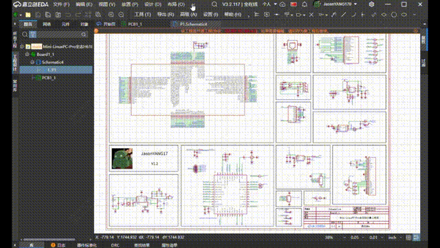
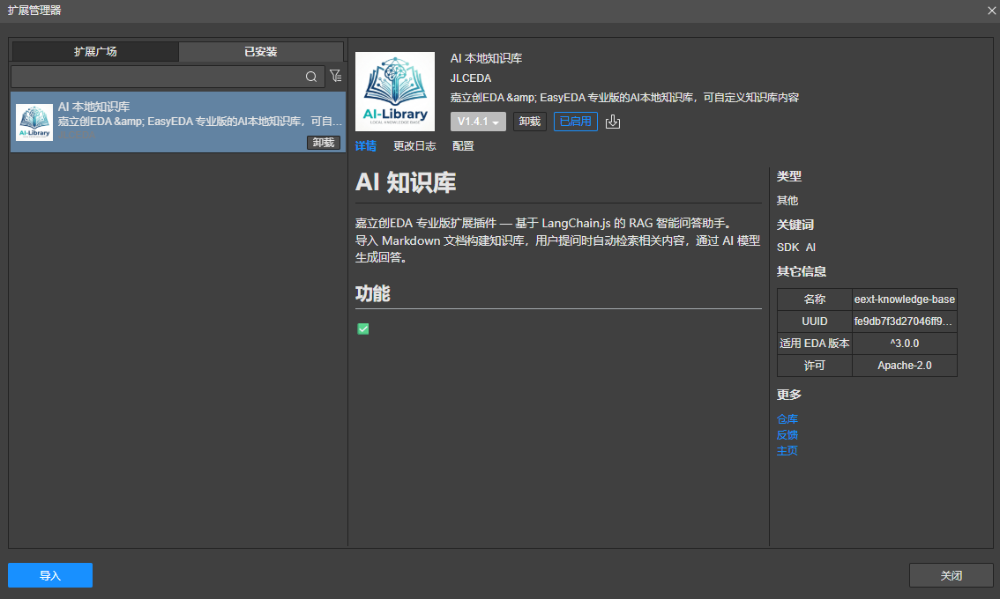
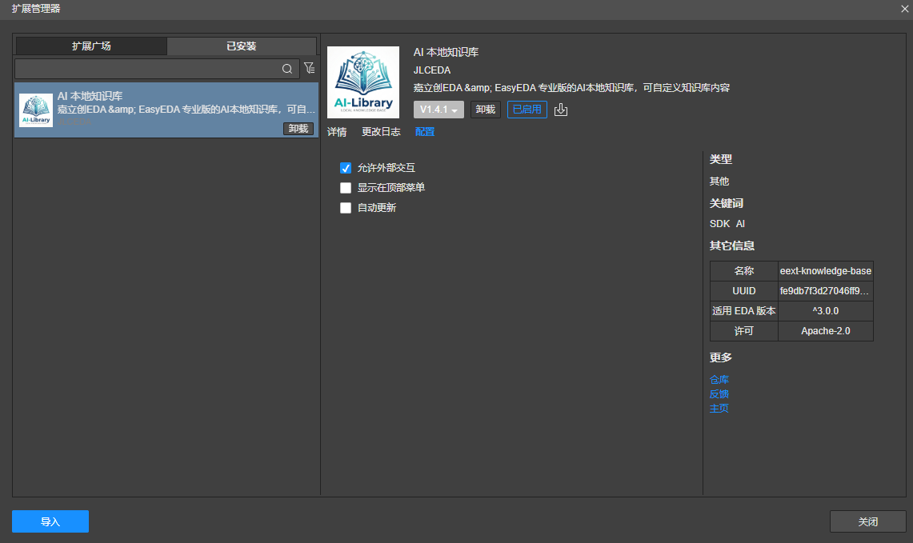
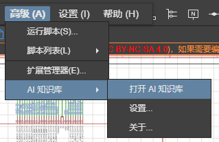

# AI 本地知识库

基于 [LangChain.js](https://github.com/langchain-ai/langchainjs) 的 RAG 智能问答助手。
导入 Markdown 文档构建知识库，用户提问时自动检索相关内容，通过 AI 模型生成回答。

本扩展内置嵌入模型：[bge-small-zh-v1.5](https://huggingface.co/BAAI/bge-small-zh-v1.5)

## 功能
✅ 本地嵌入小型向量模型，支持自建自定义知识库

✅ 集成wiki.lceda.cn的PCB设计与生产文档，设计生产随问随答

## 安装
## 使用方法
1.在"高级"-"扩展管理器"中导入eext-knowledge-base.eext扩展文件。

2.在"配置"中开启"允许外部交互"选项

3.进入原理图或PCB界面，点击顶部导航栏"高级"-"AI 知识库"选择需要的功能即可。

## 致谢

- [LangChain.js](https://github.com/langchain-ai/langchainjs) — RAG 流程框架（MIT）
- [Transformers.js](https://github.com/huggingface/transformers.js) — 浏览器端模型推理（Apache-2.0）
- [bge-small-zh-v1.5](https://huggingface.co/BAAI/bge-small-zh-v1.5) — 中文嵌入模型（MIT）
