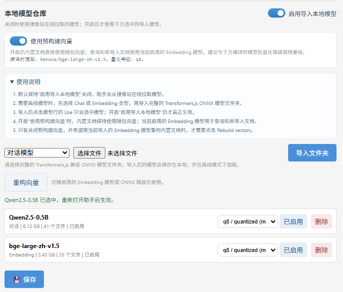
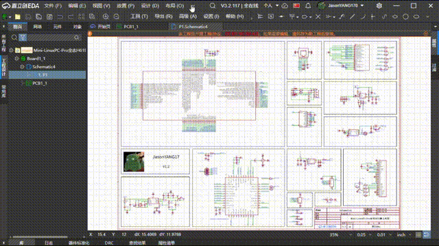
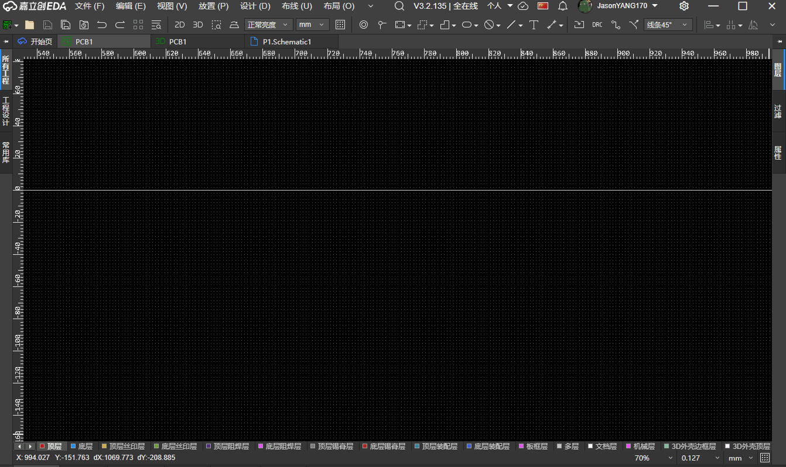
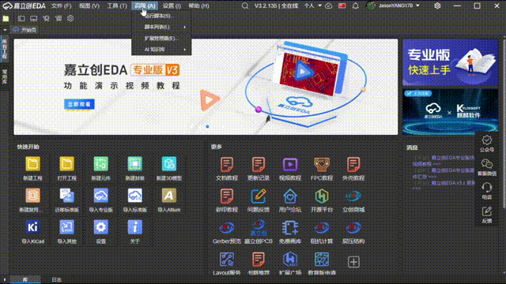
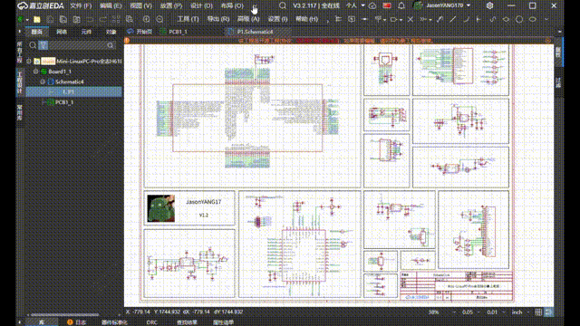
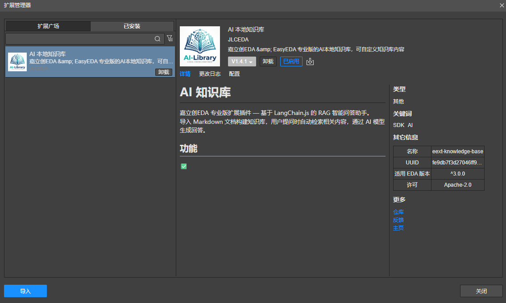
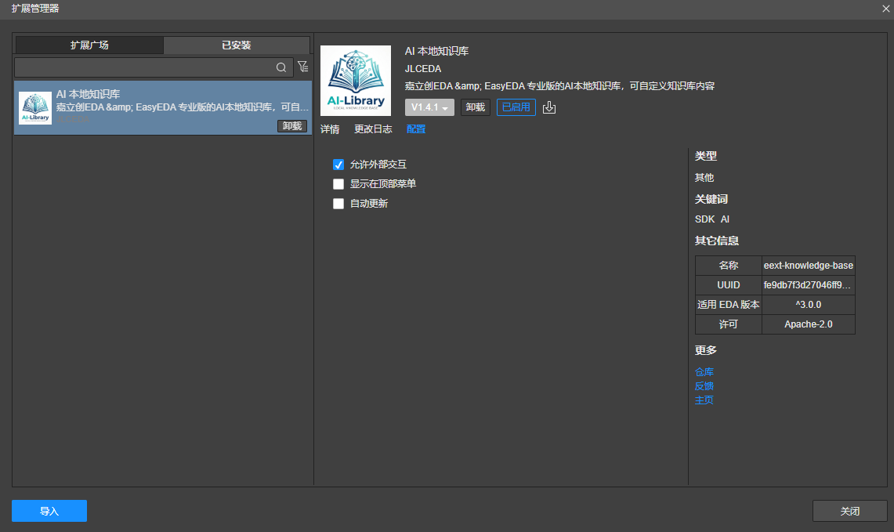
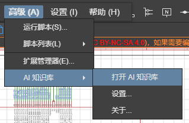

# AI 本地知识库

[English](./README.en.md)

基于 [LangChain.js](https://github.com/langchain-ai/langchainjs) 的 RAG 智能问答助手。
导入 Markdown 文档构建知识库，用户提问时自动检索相关内容，通过 AI 模型生成回答。

- 默认向量模型：[bge-large-zh-v1.5](https://huggingface.co/BAAI/bge-large-zh-v1.5)
- 默认通用模型：[Qwen2.5-0.5B-Instruct](https://huggingface.co/onnx-community/Qwen2.5-0.5B-Instruct)
- 浏览器无模型缓存时将默认从 [HF-Mirror](https://hf-mirror.com/) 镜像站拉取并缓存
- 缓存后将不再依赖于网络，可接入 [Ollama](https://ollama.com/) 本地部署通用模型实现完全本地化

**建议在嘉立创EDA专业版客户端使用此扩展**  

### 本地模式说明

#### 模型类型说明
扩展基于Transformers.js库构建，支持ONNX模型。首次运行默认会从镜像站在线拉取ONNX模型，若镜像站无法拉取，也可通过本地导入ONNX模型文件夹，导入后文件会存入浏览器缓存，建议导入时只选择需要使用的模型文件，避免占用空间。

#### 向量模型说明
扩展在编译时已经预构建全文档向量，预构建所用模型会在设置中显示，在线拉取的模型默认也是预构建所使用的模型和向量维度，因此可直接使用预构建向量。若使用其他向量模型，因向量维度不同则需要对全部文档重构向量，将耗费大量时间，通常不推荐。

#### LLM模型说明
LLM模型推荐使用大于4B参数的模型才会有良好体验，需要注意的是本地LLM运行会占用大量内存，确保电脑有足够内存用于推理，建议使用在线模型，也可使用ollama等框架本地部署后使用openai格式的api接入。

## 功能
### ✅ 支持接入通用模型API，借助本地向量模型可实现根据知识库内容的智能答疑

### ✅ 支持本地向量模型，可完成知识库内容的快速关键词检索

### ✅ 支持本地通用模型+向量模型，实现根据知识库内容问答

### ✅ 集成prodocs.lceda.cn全部文档，遇到问题随问随答

## 安装
## 使用方法
1.在"高级"-"扩展管理器"中导入eext-knowledge-base.eext扩展文件。

2.在"配置"中开启"允许外部交互"选项

3.进入原理图或PCB界面，点击顶部导航栏"高级"-"AI 知识库"选择需要的功能即可。

## 致谢

- [LangChain.js](https://github.com/langchain-ai/langchainjs) — RAG 流程框架（MIT）
- [Transformers.js](https://github.com/huggingface/transformers.js) — 浏览器端模型推理（Apache-2.0）
- [bge-large-zh-v1.5](https://huggingface.co/BAAI/bge-large-zh-v1.5) — 中文嵌入模型（MIT）
- [HF-Mirror](https://hf-mirror.com/) - Hungging Face国内公益镜像站
